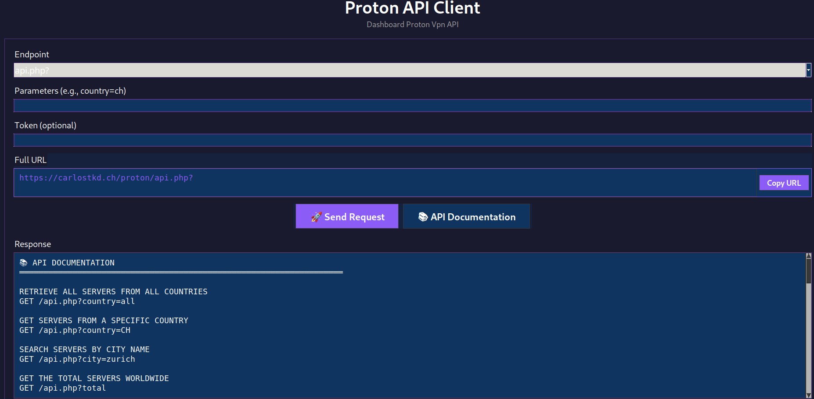

# Proton Vpn API Python Client App 

[Download](https://carlostkd.ch/proton/download.php)



## Prerequisites

- Python 3.7 or higher
- `curl` command-line tool (usually pre-installed on macOS/Linux)

## Installation 

**macOS:**
```bash
brew install python3
```

**Linux (Ubuntu/Debian):**
```bash
sudo apt update
sudo apt install python3 python3-tk
```

### 2. Install curl (if needed)

**Windows:**
- Download from [curl.se](https://curl.se/windows/)
- Or use Windows built-in curl (Windows 10/11)

**macOS:**
```bash
# Usually pre-installed, or:
brew install curl
```

**Linux:**
```bash
sudo apt install curl
```

### 3. Save the Application

1. Copy the Python code to a file named `Vpn_client.py`
2. Save it in a directory of your choice

### 4. Run the Application

Open a terminal/command prompt in the directory where you saved the file:

```bash
python proton_client.py
```

Or on some systems:
```bash
python3 Vpn_client.py
```

## Usage

1. **Select an endpoint** from the dropdown menu
2. **Enter parameters** (e.g., `country=CH` or `city=zurich`)
3. **Add a token** (optional) for authenticated requests
4. Click **"🚀 Send Request"** to execute the API call
5. Click **"📚 API Documentation"** to view available endpoints

## Troubleshooting

### "tkinter not found" error

**Linux:**
```bash
sudo apt install python3-tk
```

**macOS:**
```bash
brew install python-tk
```

### "curl not found" error

Make sure curl is installed and accessible from your PATH:
```bash
curl --version
```

If not installed, follow the curl installation steps above.

### Permission Issues (Linux/macOS)

Make the script executable:
```bash
chmod +x proton_client.py
./proton_client.py
```

## Features

✨ **Dark theme **
🎨 **Clean, intuitive interface**  
📋 **Copy URL to clipboard** with one click  
📚 **Built-in API documentation**  
⚡ **Real-time URL preview**  
🔒 **Token input**   
🚀 **Async requests** with loading indicators

## Requirements Summary

- Python 3.7+
- tkinter (usually included with Python)
- curl command-line tool
- No additional Python packages required!

## Support

For issues or questions about the API, open a issue or send a Message to *0001337

---

